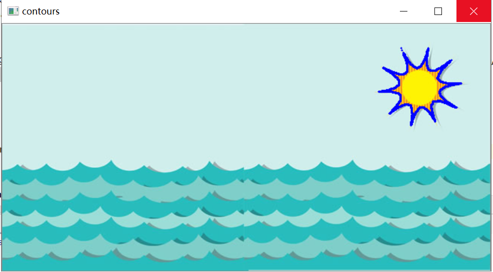

# 数字图像处理（颜色)

## 定义

让机器对图片进行识别、分割，把我们需要的颜色部分割出来；主要是利用python现有的一些模组来进行。

## RGB

RGB 是最常用于显示器的色彩空间，**R(red)是红色通道，G(green)是绿色，B(blue)是蓝色通道**。这三种颜色以不同的量进行叠加，就可以显示出五彩缤纷的色彩。

在 RGB 格式里(0,0,0)代表着黑色，(255,255,255)代表着白色。R 通道数值越高，说明颜色中含有的红色分量越多；G 通道数值越高，说明颜色中含有的绿色分量越多；B 通道数值越高，说明颜色中含有的蓝色分量越多。

这是最基础的一种识别图像颜色的方法，使用起来非常简单，只需要设好三个通道的数值范围即可；但是这种方式不适用于颜色过于缤纷的图片且这种途径受光照影响较大。

~~~python
import cv2
import numpy as np
from numpy.core._multiarray_umath import ndarray

img=cv2.imread("text2.jpg")
Lower = np.array([0, 0, 100])
Upper = np.array([40, 40, 255])
Binary = cv2.inRange(img, Lower, Upper)
cv2.imshow("sun", Binary)
cv2.waitKey(0)
~~~

## HSV

在 HSV 色彩空间中 H，S，V 这三个通道分别代表着**色相(Hue)，饱和度(Saturation)**和**明度(Value)**。在 HSV 色彩空间中 H，S，V 这三个通道分别代表着**色相(Hue)，饱和度(Saturation)**和**明度(Value)**。

不同颜色的相应对应的区间如下图所示：

这种方式可以把亮度和颜色区分开，从而减少光照对颜色识别的影响；但其缺点是你要识别某一个颜色你必须知道这种颜色对应的H,S,V。

~~~python
import cv2
import numpy as np

img = cv2.imread("test2.jpg",cv2.IMREAD_UNCHANGED)
HSV = cv2.cvtColor(img, cv2.COLOR_BGR2HSV)  #RGB 转为 HSV
H, S, V = cv2.split(HSV)    #分离 HSV 三通道
Lowerred0 = np.array([11,43,35])
Upperred0 = np.array([34,255,255])
mask1 = cv2.inRange(HSV, Lowerred0, Upperred0)
Lowerred1 = np.array([0,43,35])
Upperred1 = np.array([11,255,255])
mask2 = cv2.inRange(HSV, Lowerred1, Upperred1)    #将红色区域部分归为全白，其他区域归为全黑
Apple = mask1 +mask2
cv2.imshow("sun", Apple)
cv2.waitKey(0)
~~~

## YUV

YUV 色彩空间实际上是把一幅彩色的图片分成了一个表示暗亮程度的**亮度信号(Luminance)Y**，和两个表示颜色的**色度信号(Chrominance)U 和 V**。**U，V**通道分别是**蓝色通道**和**红色通道**，**Y** 通道表示**亮度信息**。

U 通道数值越高，颜色就越接近蓝色，V 通道数值越高，颜色就越接近红色,Y 通道数值越高，图片则越亮。

YUV 的优点是计算相对简单，图像处理的速度很快，而且 YUV 格式对于红、蓝色都有很好的识别效果，即使光线变化，算法也可以比较稳定。但其用途主要就是识别红色和蓝色，所以主要是应用于对红色和蓝色的分割。

## 改变背景颜色

~~~python
import cv2
import numpy as np
#定义窗口名称
winName='Colors of the rainbow'
#定义滑动条回调函数，此处pass用作占位语句保持程序结构的完整性
def nothing(x):
    pass
img=cv2.imread('text2.jpg')
#颜色空间的转换
HSV = cv2.cvtColor(img, cv2.COLOR_BGR2HSV)
#新建窗口
cv2.namedWindow(winName)
#新建6个滑动条，表示颜色范围的上下边界，这里滑动条的初始化位置即为黄色的颜色范围
cv2.createTrackbar('LowerbH',winName,27,255,nothing)
cv2.createTrackbar('LowerbS',winName,160,255,nothing)
cv2.createTrackbar('LowerbV',winName,215,255,nothing)
cv2.createTrackbar('UpperbH',winName,83,255,nothing)
cv2.createTrackbar('UpperbS',winName,255,255,nothing)
cv2.createTrackbar('UpperbV',winName,255,255,nothing)
while(1):
    #函数cv2.getTrackbarPos()范围当前滑块对应的值
    lowerbH=cv2.getTrackbarPos('LowerbH',winName)
    lowerbS=cv2.getTrackbarPos('LowerbS',winName)
    lowerbV=cv2.getTrackbarPos('LowerbV',winName)
    upperbH=cv2.getTrackbarPos('UpperbH',winName)
    upperbS=cv2.getTrackbarPos('UpperbS',winName)
    upperbV=cv2.getTrackbarPos('UpperbV',winName)
    #得到目标颜色的二值图像，用作cv2.bitwise_and()的掩模
    img_target=cv2.inRange(img,(lowerbH,lowerbS,lowerbV),(upperbH,upperbS,upperbV))
    #输入图像与输入图像在掩模条件下按位与，得到掩模范围内的原图像
    img_specifiedColor=cv2.bitwise_and(img,img,mask=img_target)
    cv2.imshow(winName,img_specifiedColor)
    if cv2.waitKey(1)==ord('q'):
        break
cv2.destroyAllWindows()
~~~

## 识别太阳并输出坐标

~~~python
import cv2
import numpy as np

img = cv2.imread("test2.jpg",cv2.IMREAD_UNCHANGED)
HSV = cv2.cvtColor(img, cv2.COLOR_BGR2HSV)  #RGB 转为 HSV
H, S, V = cv2.split(HSV)    #分离 HSV 三通道
Lowerred0 = np.array([11,43,35])
Upperred0 = np.array([34,255,255])
mask1 = cv2.inRange(HSV, Lowerred0, Upperred0)

contours,hierarchy = cv2.findContours(mask1,cv2.RETR_EXTERNAL,cv2.CHAIN_APPROX_SIMPLE)#得到轮廓信息

cv2.drawContours(img, contours, -1, (255, 0, 0), 2)
# 显示图像
cv2.imshow("contours", img)
cv2.waitKey()
cv2.destroyAllWindows()
~~~

